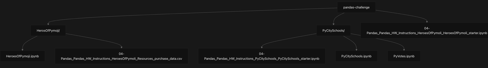
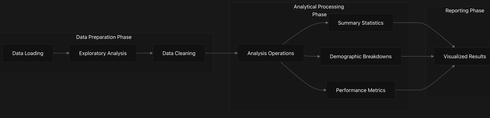
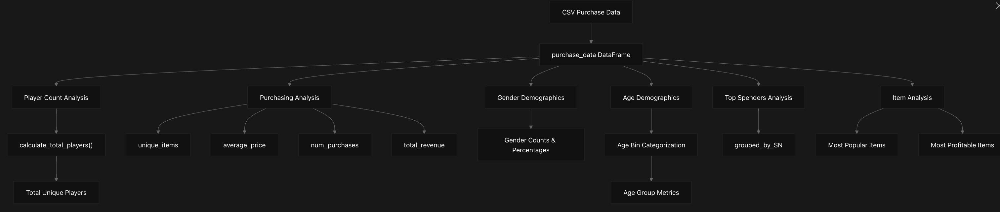
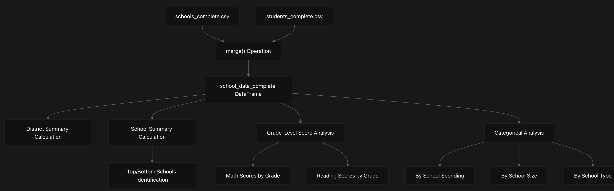
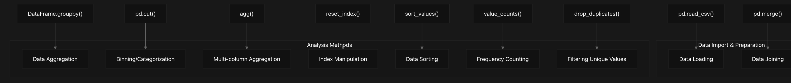
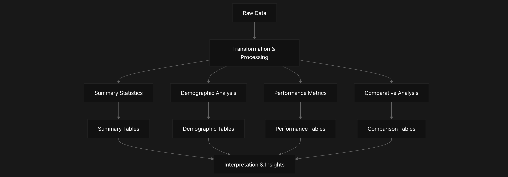

# Pandas Challenge Repository Overview

## Purpose and Scope

This document provides a technical overview of the pandas-challenge repository, which contains two primary data analysis projects implemented using Python's Pandas library. These projects demonstrate various data manipulation, aggregation, and analysis techniques commonly used in data science workflows. This page serves as an entry point to understand the repository structure, the analysis systems it contains, and how they relate to each other.

## Repository Structure
The pandas-challenge repository is organized into separate directories for each analysis project. Each project directory contains Jupyter notebooks with analysis code and data files in CSV format.

## Primary Analysis Systems

The repository contains two main data analysis systems, each with its own dataset and analytical approach:

## Heroes of Pymoli Analysis System
A comprehensive analysis of in-game purchase data for a fictional game called "Heroes of Pymoli". This system:

- Analyzes player demographics by gender and age groups
- Evaluates purchasing behaviors and identifies top spenders
- Calculates revenue metrics and item popularity
- Generates summary statistics for business insights

The primary notebook for this analysis is HeroesOfPymoli_starter.ipynb, which reads purchase data from a CSV file and processes it through several analysis steps.

## PyCitySchools Analysis System
An educational data analysis system that:

- Merges school and student datasets
-Calculates district-wide and school-level performance metrics
- Examines correlations between academic performance and factors like:
  - School spending per student
  - School size
  - School type (Charter vs. District)
- Performs grade-level score analysis by school
The main notebook for this analysis is PyCitySchools_starter.ipynb, which reads and merges data from two CSV files: schools_complete.csv and students_complete.csv.

## Data Analysis Workflow
### Title: Common Analytical Workflow in Both Systems

## Heroes of Pymoli System Details
### Title: Heroes of Pymoli Data Processing Pipeline

## PyCitySchools System Components
### Title: PyCitySchools Analysis Components and Data Flow

Sources: 
pandas-challenge/PyCitySchools/04-Pandas_Pandas_HW_Instructions_PyCitySchools_PyCitySchools_starter.ipynb
11-30
 
pandas-challenge/PyCitySchools/04-Pandas_Pandas_HW_Instructions_PyCitySchools_PyCitySchools_starter.ipynb

## Key Data Structures
### Heroes of Pymoli Data Schema

The primary data structure in the Heroes of Pymoli analysis is the purchase_data DataFrame created by loading the CSV file:
purchase_data = pd.read_csv('04-Pandas_Pandas_HW_Instructions_HeroesOfPymoli_Resources_purchase_data.csv')

This DataFrame contains the following columns:

Column Name	Data Type	Description
Purchase ID	Integer	Unique identifier for each purchase
SN	String	Screen Name (player identifier)
Age	Integer	Player's age
Gender	String	Player's gender
Item ID	Integer	Unique identifier for the purchased item
Item Name	String	Name of the purchased item
Price	Float	Cost of the item

Sources: 
pandas-challenge/04-Pandas_Pandas_HW_Instructions_HeroesOfPymoli_HeroesOfPymoli_starter.ipynb
24-52

PyCitySchools Data Schema
The PyCitySchools analysis uses two primary DataFrames that are merged into a combined dataset:

    school_data = pd.read_csv(school_data_to_load)
    student_data = pd.read_csv(student_data_to_load)
    school_data_complete = pd.merge(student_data, school_data, how="left", on=["school_name", "school_name"])

School Data Structure:
Column Name	Data Type	Description
School ID	Integer	Unique identifier for each school
school_name	String	Name of the school
type	String	School type (District or Charter)
size	Integer	Number of students
budget	Float	School budget

Student Data Structure:
Column Name	Data Type	Description
Student ID	Integer	Unique identifier for each student
school_name	String	Name of the student's school
name	String	Student's name
gender	String	Student's gender
grade	String	Student's grade level
reading_score	Integer	Student's reading test score
math_score	Integer	Student's math test score

Sources: 
pandas-challenge/PyCitySchools/04-Pandas_Pandas_HW_Instructions_PyCitySchools_PyCitySchools_starter.ipynb

## Common Pandas Analysis Techniques
Both analysis systems utilize similar Pandas techniques for data manipulation and analysis:

### Title: Core Pandas Techniques Used in Both Systems

Sources: 
pandas-challenge/04-Pandas_Pandas_HW_Instructions_HeroesOfPymoli_HeroesOfPymoli_starter.ipynb
177-180
 
pandas-challenge/04-Pandas_Pandas_HW_Instructions_HeroesOfPymoli_HeroesOfPymoli_starter.ipynb
262-267
 
pandas-challenge/04-Pandas_Pandas_HW_Instructions_HeroesOfPymoli_HeroesOfPymoli_starter.ipynb
316-323
 
pandas-challenge/04-Pandas_Pandas_HW_Instructions_HeroesOfPymoli_HeroesOfPymoli_starter.ipynb
544
 
pandas-challenge/04-Pandas_Pandas_HW_Instructions_HeroesOfPymoli_HeroesOfPymoli_starter.ipynb
757-766
 
pandas-challenge/04-Pandas_Pandas_HW_Instructions_HeroesOfPymoli_HeroesOfPymoli_starter.ipynb
1063-1072
 
pandas-challenge/PyCitySchools/04-Pandas_Pandas_HW_Instructions_PyCitySchools_PyCitySchools_starter.ipynb
11-30

## Summary Metrics and Visualizations
Both analysis projects generate similar types of summary statistics and report outputs:

### Heroes of Pymoli Key Metrics:
- Player Demographics: Total players, gender distribution, age distribution
- Purchasing Analysis: Number of unique items, average purchase price, total purchases, total revenue
- Top Spenders: Identifies players who spend the most money
- Popular Items: Ranks items by purchase frequency and total revenue
### PyCitySchools Key Metrics:
- District Summary: Total schools, students, budget, and average test scores
- School Performance: Rankings of top and bottom performing schools
- Score Analysis: Math and reading scores by grade level
- Categorical Analysis: Performance metrics grouped by spending, size, and school type

### Title: Analysis Output Structure

Sources: 
pandas-challenge/04-Pandas_Pandas_HW_Instructions_HeroesOfPymoli_HeroesOfPymoli_starter.ipynb
150-205
 
pandas-challenge/04-Pandas_Pandas_HW_Instructions_HeroesOfPymoli_HeroesOfPymoli_starter.ipynb
280-325
 
pandas-challenge/04-Pandas_Pandas_HW_Instructions_HeroesOfPymoli_HeroesOfPymoli_starter.ipynb
444-546
 
pandas-challenge/PyCitySchools/04-Pandas_Pandas_HW_Instructions_PyCitySchools_PyCitySchools_starter.ipynb
30-136
 
pandas-challenge/PyCitySchools/04-Pandas_Pandas_HW_Instructions_PyCitySchools_PyCitySchools_starter.ipynb
835-972

## Conclusion
The pandas-challenge repository showcases two comprehensive data analysis projects demonstrating various Pandas techniques for data manipulation, aggregation, and visualization. The Heroes of Pymoli analysis focuses on gaming purchase behavior and demographics, while the PyCitySchools analysis examines educational performance metrics across different schools and categories.

Both systems follow a similar analytical approach:

1. Loading data from CSV files
2. Cleaning and transforming the data
3. Performing aggregations and calculations
4. Presenting results in formatted tables

These projects serve as examples of how to effectively use Pandas for data analysis tasks and provide templates for similar analyses in gaming and educational contexts.
